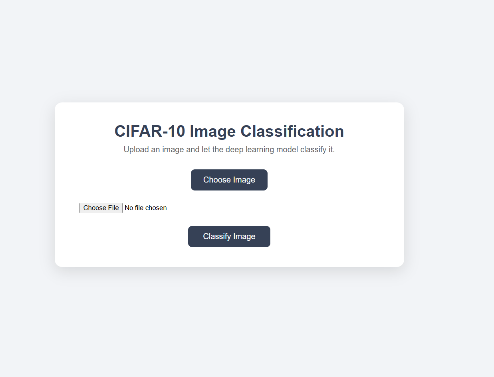
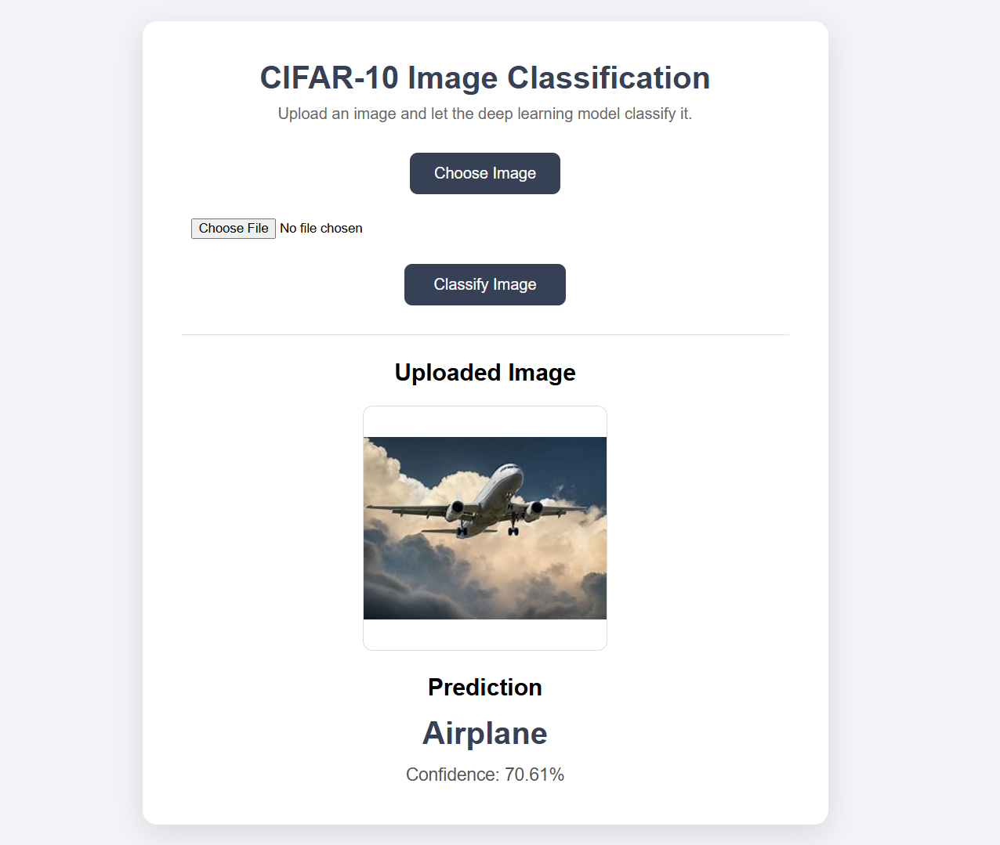

<div align="center">

# 🖼️ CIFAR‑10 Image Classification

### Deep Learning powered image classifier with a live Flask web app

*Upload any image and let a Convolutional Neural Network tell you what it sees — Airplane, Cat, Truck, and 7 more.*


</div>

---

## 📑 Table of Contents

- [Project Overview](#-project-overview)
- [Demo](#-demo)
- [Features](#-features)
- [Tech Stack](#-tech-stack)
- [Project Structure](#-project-structure)
- [Workflow](#-workflow)
- [Dataset](#-dataset)
- [Exploratory Data Analysis](#-exploratory-data-analysis)
- [Data Preprocessing](#-data-preprocessing)
- [Model Architecture](#-model-architecture)
- [Model Performance](#-model-performance)
- [Installation](#-installation)
- [Usage](#-usage)
- [Example Predictions](#-example-predictions)
- [Visualizations](#-visualizations)
- [Configuration](#-configuration)
- [Future Improvements](#-future-improvements)
- [Contributing](#-contributing)
- [License](#-license)
- [Author](#-author)
- [Acknowledgements](#-acknowledgements)
- [Recruiter Highlights](#-why-this-project-stands-out)

---

## 🌍 Project Overview

This project implements an **end-to-end image classification system** built on the classic **CIFAR‑10** dataset, wrapped in a **Flask web application** that lets a user upload any image and receive a real-time prediction with a confidence score.

> **Why it matters:** Image classification is a foundational computer vision task that powers everything from content moderation and product tagging to autonomous vehicles and medical imaging. This project demonstrates the complete lifecycle of a CNN-based classifier — from raw pixel data to a deployable, user-facing web interface.

**Real-world applications:**
- 🏷️ Automated image tagging / cataloguing
- 🚗 Foundational building block for autonomous vehicle perception (vehicle vs. non-vehicle recognition)
- 📦 E-commerce product categorization
- 🎓 Educational reference implementation for CNN fundamentals

**Expected users:** ML students learning CNNs, recruiters/reviewers evaluating deep learning skills, and developers looking for a lightweight, deployable image classification template.

---

## 🎥 Demo

The project ships with real screenshots of the working web application:

**Upload Interface**



**Prediction Result**



---

## ✨ Features

- [x] Image preprocessing & normalization pipeline
- [x] Custom Convolutional Neural Network (CNN) built with Keras
- [x] Model training with validation tracking
- [x] Model evaluation on held-out test data
- [x] Saved, reusable trained model (`.h5`)
- [x] Flask-based prediction web app with file upload
- [x] Real-time inference with confidence score
- [x] Clean, responsive UI (HTML/CSS)

---

## 🧰 Tech Stack

| Category | Tools |
|---|---|
| **Language** | Python 3.12 |
| **Deep Learning** | TensorFlow, Keras |
| **Data Handling** | NumPy |
| **Image Processing** | Pillow (PIL) |
| **Web Framework** | Flask, Werkzeug |
| **Visualization (EDA)** | Matplotlib |
| **Frontend** | HTML5, CSS3 |
| **Development Environment** | Jupyter Notebook |
| **Version Control** | Git & GitHub |

---

## 📁 Project Structure

```
Image Classification of CIFAR-10/
│
├── app.py                                  # Flask application (routes + inference logic)
├── requirements.txt                        # Python dependencies
├── README.md                               # Project documentation
│
├── model/
│   └── image_classification.h5             # Trained Keras CNN model
│
├── notebooks/
│   └── image classification on CIFAR-10.ipynb   # Data loading, model training & evaluation
│
├── templates/
│   └── index.html                          # Jinja2 HTML template for the web UI
│
├── static/
│   ├── css/
│   │   └── style.css                       # App styling
│   └── uploads/                            # User-uploaded images (runtime storage)
│       ├── aeroplane.jpg
│       ├── dog.jpg
│       └── horse.jpg
│
└── Images/
    ├── cifar-image-classification-ui.png       # App screenshot
    └── cifar-image-classification-result.png   # Prediction screenshot
```

**Folder explanations:**
- **`model/`** — stores the trained `.h5` CNN weights loaded by the Flask app at runtime.
- **`notebooks/`** — contains the full experimentation notebook: data loading, preprocessing, model definition, training, and evaluation.
- **`templates/` & `static/`** — standard Flask front-end assets (HTML view + CSS + uploaded image storage).
- **`Images/`** — documentation assets used in this README.

---

## 🔄 Workflow

```
Data Collection (CIFAR-10 via Keras datasets API)
        ↓
Normalization (pixel scaling to [0, 1])
        ↓
Label Encoding (one-hot via to_categorical)
        ↓
Model Building (CNN architecture)
        ↓
Model Training (10 epochs, Adam optimizer)
        ↓
Model Evaluation (test accuracy)
        ↓
Model Persistence (.h5 export)
        ↓
Deployment (Flask web app for real-time prediction)
```

---

## 📊 Dataset

| Detail | Description |
|---|---|
| **Source** | [CIFAR-10](https://www.cs.toronto.edu/~kriz/cifar-10-python.tar.gz), loaded via `tensorflow.keras.datasets.cifar10` |
| **Samples** | 50,000 training images + 10,000 test images |
| **Image size** | 32×32 pixels, RGB (3 channels) |
| **Target variable** | Image class (10 categories) |
| **Classes** | Airplane, Automobile, Bird, Cat, Deer, Dog, Frog, Horse, Ship, Truck |
| **Missing values** | None — CIFAR-10 is a clean, standardized benchmark dataset |

---

## 🔍 Exploratory Data Analysis

The notebook performs a lightweight visual inspection of the dataset by plotting a grid of sample training images to confirm correct loading and labeling before moving into preprocessing. No deeper statistical EDA (class distribution plots, pixel intensity histograms, etc.) is currently included.

> Since CIFAR-10 is a balanced benchmark dataset (equal samples per class), further class-distribution analysis was not required for this iteration.

---

## 🧹 Data Preprocessing

| Step | Applied |
|---|---|
| **Missing value handling** | Not applicable (no missing values in CIFAR-10) |
| **Normalization** | Pixel values scaled from `[0, 255]` → `[0, 1]` (`astype('float32') / 255.0`) |
| **Label encoding** | One-hot encoding via `to_categorical` |
| **Feature selection** | Not applicable (raw pixel input to CNN) |
| **Outlier treatment** | Not implemented |
| **Train/test split** | Used CIFAR-10's standard predefined split (50,000 train / 10,000 test) |
| **Inference-time preprocessing** | Uploaded images are resized to 32×32, converted to RGB, and normalized identically to training data (see `app.py`) |

---

## 🧠 Model Architecture

A **custom sequential CNN** built with Keras:

```python
model = Sequential()

model.add(Conv2D(32, (3, 3), padding='same', activation='relu', kernel_constraint=MaxNorm(3)))
model.add(Dropout(0.2))

model.add(Conv2D(32, (3, 3), padding='same', activation='relu', kernel_constraint=MaxNorm(3)))
model.add(MaxPooling2D(pool_size=(2, 2)))

model.add(Flatten())

model.add(Dense(512, activation='relu', kernel_constraint=MaxNorm(3)))
model.add(Dropout(0.5))

model.add(Dense(num_classes, activation='softmax'))
```

| Property | Value |
|---|---|
| **Total parameters** | 4,210,090 |
| **Optimizer** | Adam (learning rate = 0.001) |
| **Loss function** | Categorical Crossentropy |
| **Regularization** | Dropout (0.2, 0.5) + MaxNorm weight constraint |
| **Epochs** | 10 |
| **Batch size** | 32 |

## 🗂️ Models Used

| Model | Purpose |
|---|---|
| Custom CNN (2× Conv2D + MaxPooling + Dense) | Multi-class image classification (final/only model) |

---

## 📈 Model Performance

> Only metrics actually computed in the notebook are reported below — no precision, recall, F1, or ROC-AUC were calculated in this project.

| Metric | Value |
|---|---|
| **Final Training Accuracy** | ~72.7% |
| **Final Validation Accuracy** | ~70.5% |
| **Test Accuracy** (`model.evaluate`) | **69.91%** |
| **Test Loss** | 0.8545 |

> 💡 **Note:** With only 2 convolutional layers and 10 training epochs, this model serves as a solid baseline. See [Future Improvements](#-future-improvements) for accuracy-boosting ideas.

---

## ⚙️ Installation

```bash
# 1. Clone the repository
git clone https://github.com/your-username/Image-Classification-of-CIFAR-10.git

# 2. Move into the project directory
cd "Image Classification of CIFAR-10"

# 3. (Recommended) Create a virtual environment
python -m venv venv
source venv/bin/activate      # On Windows: venv\Scripts\activate

# 4. Install dependencies
pip install -r requirements.txt
```

---

## 🚀 Usage

Run the Flask app locally:

```bash
python app.py
```

Then open your browser and navigate to:

```
http://127.0.0.1:5000/
```

Upload any image (JPEG/PNG) and click **"Classify Image"** to get an instant prediction with a confidence score.

> To retrain the model from scratch, open and run `notebooks/image classification on CIFAR-10.ipynb`, then save the resulting `.h5` file into the `model/` directory.

---

## 🔮 Example Predictions

Sample images bundled in `static/uploads/` and their expected classification behavior:

| Input Image | Expected Class |
|---|---|
| `aeroplane.jpg` | Airplane |
| `dog.jpg` | Dog |
| `horse.jpg` | Horse |

> Actual predicted labels and confidence percentages are generated live by the app and displayed on the result page (see [Demo](#-demo) screenshot above).

---

## 🖼️ Visualizations

- ✅ Sample training image grid (in notebook)
- ✅ Web app UI screenshot — `Images/cifar-image-classification-ui.png`
- ✅ Prediction result screenshot — `Images/cifar-image-classification-result.png`

---

## 🔧 Configuration

| Parameter | Location | Default |
|---|---|---|
| Upload folder | `app.py` → `UPLOAD_FOLDER` | `static/uploads` |
| Model path | `app.py` → `load_model(...)` | `model/image_classification.h5` |
| Input image size | `app.py` → `image.resize(...)` | `(32, 32)` |
| Training epochs | Notebook → `model.fit(...)` | `10` |
| Batch size | Notebook → `model.fit(...)` | `32` |
| Learning rate | Notebook → `Adam(...)` | `0.001` |
| Flask debug mode | `app.py` → `app.run(...)` | `debug=True` |

---

## 🗺️ Future Improvements

- 🐳 Dockerize the application for consistent deployment
- ☁️ Deploy to a live platform (Render, Railway, Hugging Face Spaces, or AWS)
- 🧪 Add a CI/CD pipeline (GitHub Actions) for automated testing
- 🏗️ Deepen the CNN architecture (additional Conv/BatchNorm layers) to improve accuracy beyond ~70%
- 🎯 Add data augmentation (rotation, flip, zoom) to reduce overfitting
- 🧮 Track additional metrics: precision, recall, F1-score, confusion matrix
- 🔍 Add model explainability (Grad-CAM / SHAP / LIME) to visualize what the CNN "sees"
- 📊 Add training curves (accuracy/loss vs. epochs) to the README
- ✅ Add unit and integration tests for the Flask routes
- 📡 Add a REST API endpoint (JSON in/out) alongside the HTML UI

---

## 🤝 Contributing

Contributions are welcome and appreciated! To contribute:

1. **Fork** this repository
2. **Create** a new branch (`git checkout -b feature/your-feature`)
3. **Commit** your changes (`git commit -m "Add: your feature"`)
4. **Push** to your branch (`git push origin feature/your-feature`)
5. **Open** a Pull Request

Please ensure your code follows clean, readable conventions and includes relevant comments/documentation.

---

## 📄 License

> No license file was detected in this repository.

---

## 👤 Author

**Rohit Rane**

- 💻 GitHub: [@Rohitranelab](https://github.com/Rohitranelab)

---

## 🙏 Acknowledgements

- [CIFAR-10 Dataset](https://www.cs.toronto.edu/~kriz/cifar-10.html) — Alex Krizhevsky, Vinod Nair, and Geoffrey Hinton, University of Toronto
- [TensorFlow](https://www.tensorflow.org/) / [Keras](https://keras.io/) — deep learning framework
- [Flask](https://flask.palletsprojects.com/) — web application framework
- Open-source Python data science community

---

## ⭐ Why This Project Stands Out

✔ End-to-end ML pipeline — from raw dataset to deployed web app
✔ Clean, modular Flask application structure
✔ Custom CNN built and trained from scratch (no pre-trained shortcuts)
✔ Reproducible experiments via a well-documented Jupyter notebook
✔ Production-style file organization (`model/`, `static/`, `templates/`)
✔ Real, working UI with live screenshots included
✔ Professional, recruiter-ready documentation

---

<div align="center">

**If you found this project useful, consider giving it a ⭐ on GitHub!**

</div>